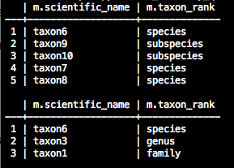

# Taxonomy POC with Neo4j

## Background

At the INBO, we're working with taxonomy data. These are highly connected entities with a typical hierarchy. We have a database that stores this data, but querying this type of data in a relational database is not straight forward. As an experiment, I'll try to implement two common use cases using Neo4j. [Neo4j]() is a graph database and I have the impression that this is a better fit for taxonomy data.

## Use cases

1. Select all downstream (lower hierarchical levels) taxa for a given taxon.
2. Select all upstream (higher hierarchical levels) taxa for a given taxon.

## Requirements to run this code

- You'll need neo4j installed and have an instance running on your local computer.
- I'm using py2neo to interact with the database. Install it with `pip install py2neo` (assuming you have Python installed)

## Results

I created a test graph containing taxonomy data. The graph looks like this:


The nodes are defined in `nodes.csv` and the total graph is defined in `testtaxonomy.dot`. The script `load_taxonomy_data.py` will parse these files and create the nodes and edges in the neo4j database. To run it, do 

```python load_taxonomy_data.py nodes.csv testtaxonomy.dot```

If all goes well, no output is given. The entities are created in the database.

The script `do_taxonomy_queries.py` implements my 2 use cases. It performs a query to select all children from the taxon `taxon3`. `taxon3` is a genus, and as you can see in the image above, this query should result in 3 species (`taxon6`, `taxon7` and `taxon8`) and 2 subspecies (`taxon9` and `taxon10`).

The next query searches for all parents of `taxon10` which should result in `taxon1`, `taxon3` and `taxon6`. That's 

The output of both queries is printed to the screen and gives us the expected results:



## Conclusion

I was very pleased by the elegance of these queries. Our problem here is actually a very typical graph problem, and neo4j indeed nicely deals with it.
